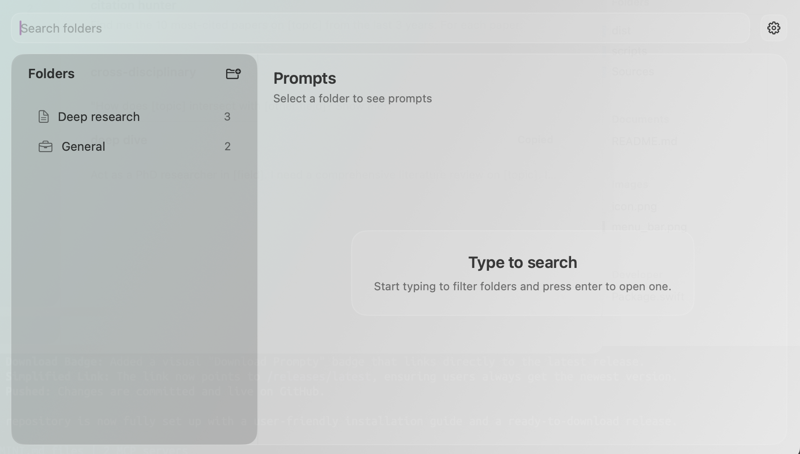

# Prompty

Prompty is a minimal, powerful menu bar application for macOS designed to help you organize and quickly access your frequently used text snippets, AI prompts, and code blocks.

<p align="center">
  
</p>

## 🚀 Features

*   **Global Hotkey:** Access your library instantly from anywhere with `Cmd + Shift + Space` (customizable).
*   **Organized Library:** Group your prompts into folders with custom icons for better organization.
*   **Lightning Fast Search:** Type to filter folders or prompts instantly. Keyboard-centric navigation lets you find and copy without lifting your hands.
*   **One-Click Copy:** Select a prompt and press `Enter` (or double-click) to copy its content directly to your clipboard.
*   **Beautiful UI:** Native macOS design with a modern "glass" aesthetic.
*   **Customizable:**
    *   **Themes:** Light, Dark, or System.
    *   **Typography:** Choose from System, Avenir Next, Menlo (great for code), or Georgia. Adjust font sizes to your liking.
    *   **Window:** Adjust window opacity/transparency.

## 💡 How It Works

1.  **Open:** Press the global hotkey (default: `⌘ ⇧ Space`) or click the menu bar icon.
2.  **Navigate:**
    *   **Search:** Start typing to filter your folders.
    *   **Enter Folder:** Press `Enter` on a selected folder to view its prompts.
    *   **Select Prompt:** Use arrow keys or type to filter prompts within a folder.
3.  **Act:**
    *   **Copy:** Press `Enter` on a prompt to copy its text to your clipboard. The window will auto-hide so you can paste immediately.
    *   **Create:** Use `Cmd + N` to create a new prompt or `Cmd + Shift + N` for a new folder.

## 📥 Installation

**For Users:**

1.  **Download** the latest version:
    <br>
    <a href="https://github.com/benshen94/prompty/releases/latest">
      
    </a>
2.  **Open** the downloaded `Prompty.dmg` file.
3.  **Drag** the Prompty app into your **Applications** folder.
4.  Open **Prompty** from your Applications folder.

*Note: Since this app is not yet notarized by Apple, you may need to Right-Click the app and select "Open" the first time you run it.*

---

## 🛠️ Development

If you want to build the app from source or contribute.

### Requirements
- macOS 13.0 or later
- Swift 5.9+ (installed via Xcode or command line tools)

### Building & Running

**Run directly:**
```bash
swift run
```

**Create Standalone App & DMG:**
This will create `dist/Prompty.dmg` and `dist/Prompty.app`.
```bash
./scripts/package_app.sh
```

**Install Locally (Dev):**
Builds and installs directly to your `/Applications` folder.
```bash
./scripts/install_app.sh
```
